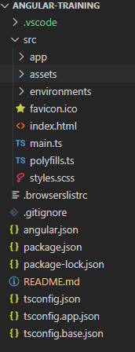
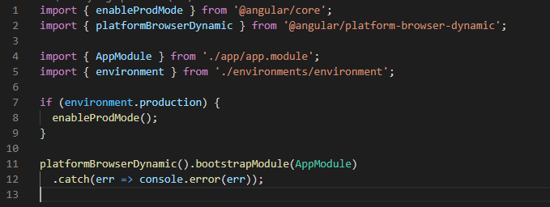
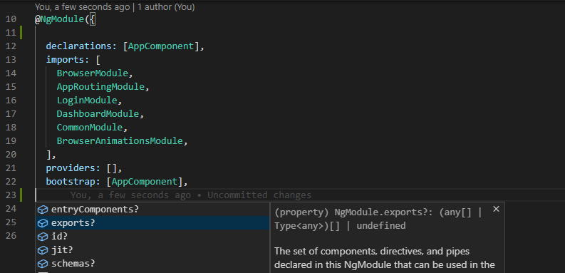

## Chapter-1: Building blocks of an Angular App

When you create a new project, You will see a directory structure like 

Lets discuss about some key files in an angular app.

> Note: We will not discuss all files in this brief intro but if you are interested, you can find details [here](https://angular.io/guide/file-structure)

If you have ever written a C program, then you must know that the first and the only function to be called by the runtime is `main`. So is this file `main.ts`. The app starts from within this file.

Lines 11 and 12 are responsible for starting the app. The `bootstrapModule` function takes the module to bootstrap and this module in-turn defines which component to bootstrap. So once the bootstraping is done, we see the app on screen.

**Now Let's talk about the Root module(`AppModule`)**

AppModule is just a typescript class with a decorator `NgModule` which makes it an Angular Module.

Since this class is exported using `export` keyword, it is available to be imported into different files like in `main.ts`.

> Note: typescript export and import keywords make the file a typescript module and everything which is exported from a module can be imported into other modules. 

> Typescript modules and Angular modules are different.

*Now lets see some metadata options available in a module*

| Property        | Description                                                                          |
| --------------- | ------------------------------------------------------------------------------------ |
| declarations    | Used to declare all the `Components`, `Directives` and `Pipes`.                      |
|                 | By declaring these in the module, we make them available in this module.             |
| imports         | Used to import other modules, so that we can use their exported members inside       |
|                 | this module                                                                          |
| providers       | Used to register services in the DI. All services registered here are available      |
|                 | to this module and all its child modules                                             |
| bootstrap       | Used to define a component which will be created along with this module. This        |
|                 | also gets registered inside `entryComponents`                                        |
| entryComponents | Used to declare Components which are used dynamically in the application. This       |
|                 | gives angular a hint that even if these components are not included in the HTML      |
|                 | They need to be a part of the final build                                            |
| exports         | Used to export an imported `module` or declared `Component`, `Directive` or a `Pipe` |

| ~~< Previous~~ | [Schematics >](./chapter2.md) |
| -------------- | ----------------------------- |