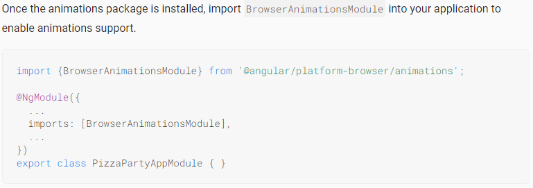

## Chapter-2: Schematics

Schmatics are there to make our lives easy. They are a set of instructions to the angular CLI to 
automate some redundant tasks.

Consider an example of adding a library into your Angular project. You have to follow some sequence of steps to achieve this and these steps are always the same for each project.

This redundancy can be remove by using Schmatics. You can read more [here](https://angular.io/guide/schematics)

Now lets take an example of Angular material and lets see the steps to add it to a project with and without schematics

**Add Angular Material without Schmatics**

| Step | Step Details                                                                                                             |
| ---- | ------------------------------------------------------------------------------------------------------------------------ |
| 1    | RUN `npm install --save @angular/material @angular/cdk @angular/animations`                                              |
| 2    |                                                                                    |
| 3    | Add `@import "~@angular/material/prebuilt-themes/indigo-pink.css";` to style.css                                         |
| 4    | Add HammerJS for Gesture Support [See](https://v7.material.angular.io/guide/getting-started#step-5-gesture-support)      |
| 5    | Add material icon support [See](https://v7.material.angular.io/guide/getting-started#step-6-optional-add-material-icons) |

**Add Angular Material using Schematics**

| Step | Step Details                   |
| ---- | ------------------------------ |
| 1    | RUN `ng add @angular/material` |

That's it! We added Angular Material with one single command

There are two types of Schematics, One used with `ng add` and the other used with `ng generate`. You can read more about these [here](https://angular.io/guide/schematics)

| [< Building blocks of an Angular App](./chapter1.md) | [Create First Angular Component >](./chapter3.md) |
| ---------------------------------------------------- | ------------------------------------------------- |

