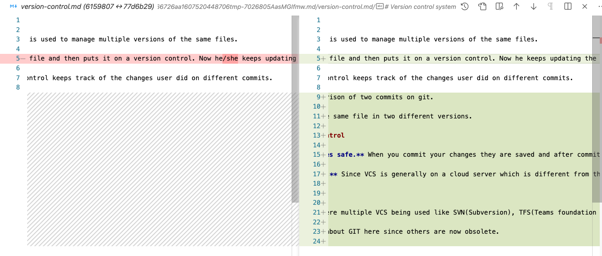

# Version control system

A version control system is used to manage multiple versions of the same files.

Suppose a user creates a file and then puts it on a version control. Now he keeps updating the content of the file and after every change, he commits the file to the version control.

On doing this, Version control keeps track of the changes user did on different commits.

For eg. lets see a comparison of two commits on git.

The above image shows the same file in two different versions.

## Why to use Version control

-   **To keep your changes safe.** When you commit your changes they are saved and after commiting, if you make further modifications which screw up your content, you don't have to worry. Since the last commited version is saved in the VCS. You can recover the commited versions at any time.

*   **Make a backup copy.** Since VCS is generally on a cloud server which is different from the machine you work on, Changes commited to VCS are backed up on cloud which keeps your content safe even if your computer breaks down.

## Which VCS to use?

A few years back there were multiple VCS being used like SVN(Subversion), TFS(Teams foundation server) and others. But since the advent of GIT, it has become the undefeted battle tested VCS being used in industry.

So we will discuss only about GIT here since others are now obsolete.

## GIT

### Basic terminology

Git is a **distrubuted** VCS where Remote has the actual copy and all the peers have a local snapshot of remote which they make changes on.

It has three stages

-   Working area (User makes changes in this area)
-   Staging area (Files in staging are are ready to be commited)
-   Commit area (Files commited which are still residing on local machine waiting to be pushed to Remote)

### Basic commands of GIT

#### git clone

Used to clone a repository from a remote origin

#### git status

Used to check what are the changes in the current working directory

#### git add

Used to promote files from working area to staging area

#### git commit

Used to create a local commit. This command commits all the files which are currenlty in staging area.

#### git push

Used to push all the commits to the remote server.

#### git pull

Used to get the latest code from the remote. This command updates the local snapshot to match its remote counterpart.

#### git fetch

Very similar to git pull. The major difference between `pull` and `fetch` is that, fetch is safe since it does not try to merge the remote changes to the local snapshot.

For the demo we will create a repo on gitlab. Use two users to access the repo and demo the commands